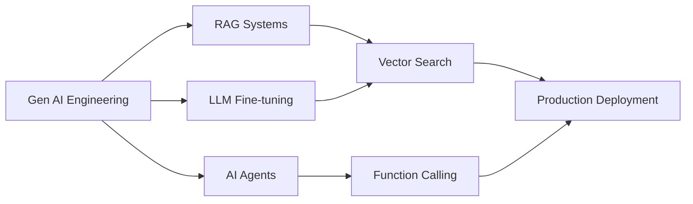

# Hi there! I'm Roushan Kumar

  

 

  
  &nbsp;&nbsp;&nbsp;
  
  &nbsp;&nbsp;&nbsp;
  
  &nbsp;&nbsp;&nbsp;
  

 

  

---

## 👨‍💻 About Me

Gen AI Engineer specializing in **RAG systems**, **LLM fine-tuning**, and **AI agents**. Built 3 production AI systems achieving **96.2% F1-score** on financial NER and real-time multi-document retrieval.

🚀 **Recent Work:**
- **DocuChat AI**: Production RAG system with LangChain + ChromaDB (1000+ document corpus)
- **Financial NER**: Fine-tuned DistilBERT to **96.2% F1-score** with <20ms/batch inference
- **FX Intelligence Agent**: GPT-4 function calling for 170+ currencies + 14 cryptocurrencies

💡 **Expertise:** RAG Architecture · BERT Fine-tuning · Vector Search · LangChain · PyTorch · Transformers

📝 **Writing:** Technical deep-dives on Medium about NER, embeddings, FAISS, and LLM evaluation

🔧 **Currently Working On:** Advanced RAG architectures, LLM evaluation frameworks, and agentic AI systems

---

## 🚀 Featured Projects

### [DocuChat AI - Document Intelligence System](https://github.com/rkuma18/DocuChat-AI)

Production-ready **RAG application** enabling natural language Q&A across multiple documents. Built with **LangChain, FastAPI, and ChromaDB** for semantic search with history-aware retrieval.

**Key Features:**
- Multi-document support (PDF, DOCX, HTML)
- History-aware conversational retrieval
- Session-based chat persistence with SQLite
- Multi-LLM support (OpenAI, Anthropic, Google)

**Tech Stack:** LangChain · ChromaDB · FastAPI · GPT-4 · Streamlit · Docker

---

### [Financial SMS NER - 96.2% F1-Score Entity Extraction](https://github.com/rkuma18/FinancialSMS-NER)

Fine-tuned **DistilBERT on 50k SMS messages** to extract 20+ financial entities achieving **96.2% F1-score, 96.2% precision, 96.2% recall**. Optimized for production with <20ms/batch inference.

**Key Achievements:**
- 96.2% F1-score on test set (20+ entity types)
- 60% faster inference vs BERT-base (DistilBERT)
- End-to-end NER pipeline with sub-word tokenization
- Streamlit web interface for real-time predictions

**Tech Stack:** PyTorch · Transformers · DistilBERT · Hugging Face · seqeval · Streamlit

---

### [FX Intelligence Agent - Multi-Currency AI Assistant](https://github.com/rkuma18/FX-Intelligence-Agent)

AI agent using **GPT-4 function calling** for intelligent currency conversion with natural language interface. Supports **170+ fiat currencies and 14 cryptocurrencies** via ExchangeRate-API and CoinGecko.

**Key Features:**
- GPT-4 tool use with 4 specialized functions
- Real-time exchange rates (fiat + crypto)
- Conversational interface with Streamlit
- Deployed on Hugging Face Spaces

**Tech Stack:** LangChain · GPT-4 · Python · Streamlit · Docker · Hugging Face Spaces

---

## 🛠️ Tech Stack

### Programming Languages

  
  &nbsp;&nbsp;
  
  &nbsp;&nbsp;
  

### AI/ML Frameworks & Tools

  
  &nbsp;&nbsp;
  
  &nbsp;&nbsp;
  
  &nbsp;&nbsp;
  
  &nbsp;&nbsp;
  
  &nbsp;&nbsp;
  
  &nbsp;&nbsp;

### Gen AI Specializations

  
  
  
  
  

### MLOps & Deployment

  
  &nbsp;&nbsp;
  
  &nbsp;&nbsp;
  
  &nbsp;&nbsp;
  
  &nbsp;&nbsp;
  

### Cloud & Databases

  
  
  
  &nbsp;&nbsp;
  

---

## 📊 GitHub Analytics

  
  

  <picture>
    <source srcset="https://streak-stats.demolab.com/?user=rkuma18&theme=radical" media="(prefers-color-scheme: dark)" />
    <source srcset="https://streak-stats.demolab.com/?user=rkuma18&theme=react" media="(prefers-color-scheme: light)" />
    
  </picture>

---

## 📝 Latest Blog Posts

<!-- BLOG-POST-LIST:START -->
- [Building a High-Performance NER System for Transactional SMS: DistilBERT Fine-tuning](https://medium.com/@rkuma18/building-a-high-performance-ner-system-for-transactional-sms-distilbert-fine-tuning-c7134813383c?source=rss-4c12f5049ddf------2)
- [From Embeddings to Search: FAISS, HNSW, and IVF-PQ Made Simple for Engineers](https://medium.com/@rkuma18/from-embeddings-to-search-faiss-hnsw-and-ivf-pq-made-simple-for-engineers-ba392e92ee6a?source=rss-4c12f5049ddf------2)
- [How to Choose the Perfect Embedding Model for Your RAG System](https://medium.com/@rkuma18/how-to-choose-the-perfect-embedding-model-for-your-rag-system-8fd902abf4cc?source=rss-4c12f5049ddf------2)
- [Responsible AI in Practice: Safety, Toxicity, and PII Testing for LLMs](https://medium.com/@rkuma18/responsible-ai-in-practice-safety-toxicity-and-pii-testing-for-llms-d3a5b9d55cee?source=rss-4c12f5049ddf------2)
- [The Complete Guide to LLM Judge Models: G-Eval and Beyond](https://medium.com/@rkuma18/the-complete-guide-to-llm-judge-models-g-eval-and-beyond-2a488385cb9c?source=rss-4c12f5049ddf------2)
<!-- BLOG-POST-LIST:END -->

➡️ [More blog posts on Medium...](https://medium.com/@rkuma18)

---

## 🎯 Current Focus

**Exploring:**
- Advanced RAG architectures (hybrid search, re-ranking)
- LLM evaluation frameworks (RAGAS, LlamaIndex)
- Agentic workflows with LangGraph
- Production MLOps for Gen AI systems

---

## 🤝 Let's Connect!

I'm always interested in collaborating on Gen AI projects, discussing RAG architectures, LLM fine-tuning strategies, or sharing insights about production AI systems.

  
  
  
  

---

  

---

  <h4>⭐ Show some love by starring repositories you find useful!</h4>
  
💬 Open to Gen AI Engineer opportunities · Building production AI systems

  

