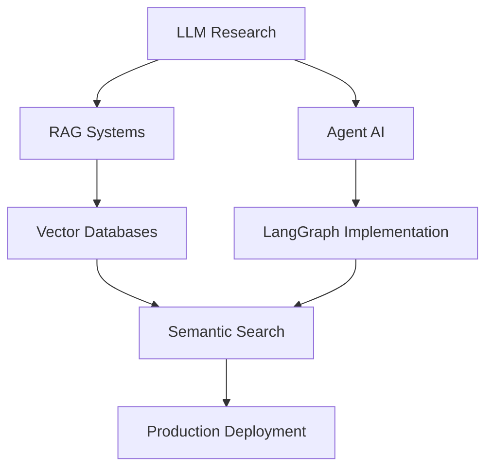

# Hi there! I'm Roushan Kumar

  

 

  
  &nbsp;&nbsp;&nbsp;
  
  &nbsp;&nbsp;&nbsp;
  
  &nbsp;&nbsp;&nbsp;
  

 

  

---

## About Me

I'm a **Data Scientist** passionate about transforming complex data into actionable insights. Currently seeking opportunities to leverage my technical expertise in machine learning, statistical analysis, and data visualization to drive business impact.

- **Currently Working On:** LLM, RAG and AgentAI
- **Learning:** MLOps, Deep Learning architectures, and Technical Content Writing
- **Interests:** LLM, Value Investing, Trekking and emerging AI technologies
- **Writing:** Technical articles on Medium about ML algorithms and data science best practices
- **Goal:** Contributing to innovative data-driven solutions that make a real-world impact

---

## Tech Stack

### Programming Languages

  
  &nbsp;&nbsp;
  
  &nbsp;&nbsp;
  

### AI/ML Frameworks

  
  &nbsp;&nbsp;
  
  &nbsp;&nbsp;
  
  &nbsp;&nbsp;
  
  &nbsp;&nbsp;
  
  &nbsp;&nbsp;
  
  &nbsp;&nbsp;
  
  &nbsp;&nbsp;

### AI/ML Specializations

  
  
  
  
  
  
  

### Development Tools

  <!-- Tableau (fallback to PNG icon) -->
  
  &nbsp;&nbsp;

  <!-- Excel (fallback to PNG icon) -->
  
  &nbsp;&nbsp;

  <!-- Docker -->
  
  &nbsp;&nbsp;

  <!-- Git -->
  
  &nbsp;&nbsp;

  <!-- DVC -->
  
  &nbsp;&nbsp;

  <!-- Jupyter -->
  
  &nbsp;&nbsp;

  <!-- MLflow -->
  
  &nbsp;&nbsp;

  <!-- VS Code (fallback to Devicon) -->
  

### Cloud Platforms

  
  
  

### Databases & Storage

  <!-- MySQL -->
  
  &nbsp;&nbsp;
  <!-- BigQuery (Google Cloud icon used as BigQuery is not separate) -->
  
  &nbsp;&nbsp;
  <!-- FAISS (Meta icon used as placeholder) -->
  
  &nbsp;&nbsp;

### Statistical Methods

  
  
  
  
  

### Core Competencies

  
  
  
  

---

## GitHub Analytics

  
  

  <picture>
    <source srcset="https://streak-stats.demolab.com/?user=rkuma18&theme=radical" media="(prefers-color-scheme: dark)" />
    <source srcset="https://streak-stats.demolab.com/?user=rkuma18&theme=react" media="(prefers-color-scheme: light)" />
    
  </picture>

  

---
## GitHub Trophies

  

---

## Latest Blog Posts

<!-- BLOG-POST-LIST:START -->
- [The NLP Landscape Till Today: From Rules to Reasoning &lpar;2025 Edition&rpar;](https://medium.com/@rkuma18/the-nlp-landscape-till-today-from-rules-to-reasoning-2025-edition-13c623d00eca?source=rss-4c12f5049ddf------2)
- [NLP Pipeline: From Words to Contextual Meaning](https://medium.com/@rkuma18/nlp-pipeline-from-words-to-contextual-meaning-2dc8358c2340?source=rss-4c12f5049ddf------2)
- [KD-Trees — Speeding Up K-NN for Large Datasets](https://medium.com/@rkuma18/kd-trees-speeding-up-k-nn-for-large-datasets-aa6d1b4ff7a5?source=rss-4c12f5049ddf------2)
- [Building a Real-World K-NN Pipeline — From Data to Deployment](https://medium.com/@rkuma18/building-a-real-world-k-nn-pipeline-from-data-to-deployment-4eaf48b5da71?source=rss-4c12f5049ddf------2)
- [Locality Sensitive Hashing &lpar;LSH&rpar; — Scaling K-NN to Billion-Scale Datasets](https://medium.com/@rkuma18/locality-sensitive-hashing-lsh-scaling-k-nn-to-billion-scale-datasets-6b643730c915?source=rss-4c12f5049ddf------2)
<!-- BLOG-POST-LIST:END -->

➡️ [More blog posts...](https://medium.com/@rkuma18)

---

## Achievements & Certifications

- **Published Technical Writer** - 5+ articles on advanced ML algorithms
- **Problem Solver** - Regular LeetCode and algorithmic challenge participant
- **AI Enthusiast** - Active contributor to open-source ML projects
- **Data Science Advocate** - Speaker at local tech meetups

---

## Current Focus

---

## Let's Connect!

I'm always interested in collaborating on data science projects, discussing ML algorithms, or sharing insights about the field. Feel free to reach out!

  
  
  
  

---

  

---

  <h4>🌟 Made with Passion by <a href="https://github.com/rkuma18" target="_blank">rkuma18</a></h4>
  
💖 Show some love by starring the repositories you find useful or inspiring!

  

